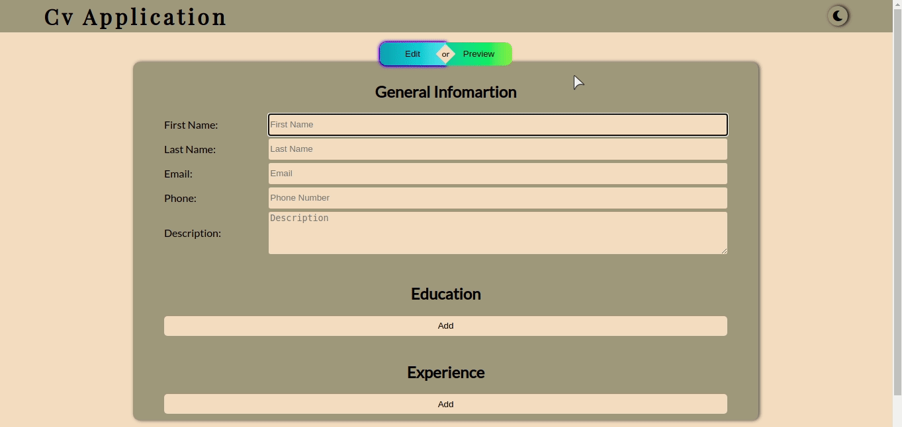
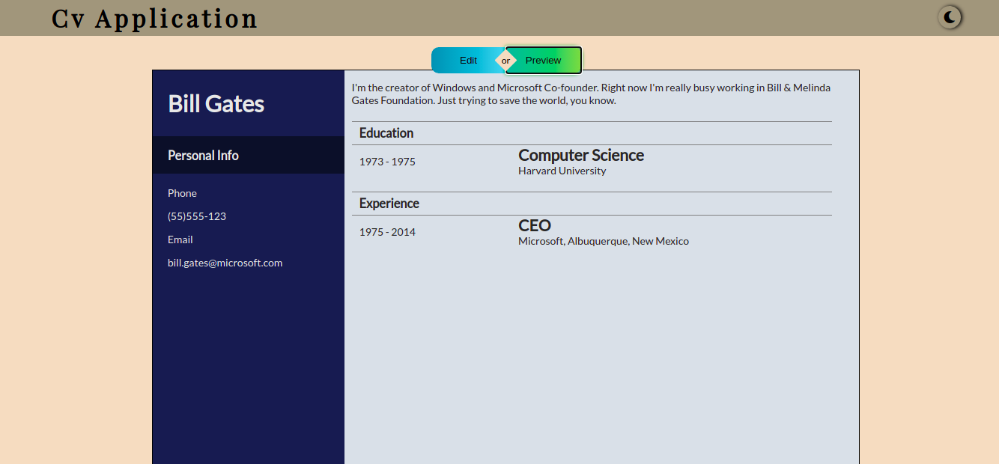

## Cv-Application

Page to create a CV, built with React.

## About
It's an application build with React that create a CV with the information that you set. This project was part of my React studies, this app is all about hooks, states and components life-cycle, basically all the React's basics. 

## Demo
### Cv-Application
 <br />
### Cv Example
 <br />

If you want to give it a try click the link below: <br />
[Live Demo](https://gabriellima77.github.io/cv-project/)

## Getting Started

If you want to use this app locally, or make your own changes, follow the steps below:

```
  git clone git@github.com:gabriellima77/cv-project.git
  cd cv-application
  npm install
  npm start
```
